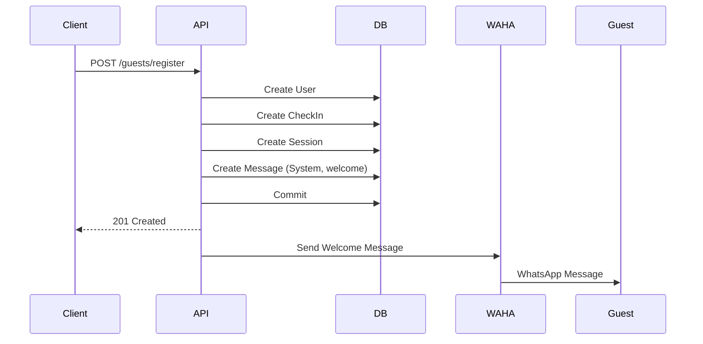
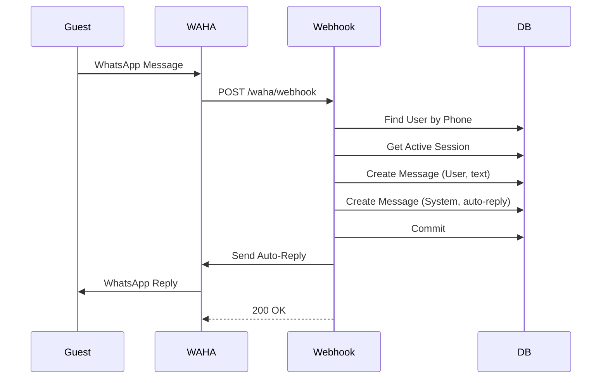

# WAHA Integration Guide

## Overview

Integrasi WAHA (WhatsApp HTTP API) memungkinkan sistem untuk mengirim dan menerima pesan WhatsApp ke/dari guest hotel. Fitur ini mencakup:

- ✅ Mengirim welcome message otomatis saat guest check-in
- ✅ Menerima pesan dari guest melalui webhook
- ✅ Menyimpan semua percakapan ke database
- ✅ Auto-reply otomatis untuk pesan guest
- ✅ Manajemen session chat

## Architecture

```
┌─────────────┐        ┌──────────────┐        ┌─────────────┐
│   Guest     │───────▶│  WAHA API    │───────▶│   System    │
│ (WhatsApp)  │◀───────│  (Webhook)   │◀───────│  (FastAPI)  │
└─────────────┘        └──────────────┘        └─────────────┘
                                                      │
                                                      ▼
                                              ┌─────────────┐
                                              │  Database   │
                                              │  (Sessions  │
                                              │  & Messages)│
                                              └─────────────┘
```

## Configuration

### Environment Variables

Tambahkan konfigurasi berikut ke file `.env`:

```env
# WAHA (WhatsApp HTTP API)
WAHA_HOST=http://localhost:3000
WAHA_API_PATH=/api/sendText
WAHA_SESSION=default
```

| Variable | Description | Default | Required |
|----------|-------------|---------|----------|
| `WAHA_HOST` | URL host WAHA service | `http://localhost:3000` | Yes |
| `WAHA_API_PATH` | API path untuk send text | `/api/sendText` | Yes |
| `WAHA_SESSION` | Session name di WAHA | `default` | Yes |

> **Note:** Sesuaikan `WAHA_HOST` dengan URL actual WAHA service Anda. Contoh untuk production: `https://waha.yourdomain.com`

## Database Schema

### Sessions Table

Menyimpan chat session antara guest dan system:

| Column | Type | Description |
|--------|------|-------------|
| `id` | UUID | Primary key |
| `session_id` | UUID | Foreign key ke `users.id` (guest) |
| `checkin_room_id` | UUID | Foreign key ke `checkin_rooms.id` |
| `is_active` | Boolean | Status session aktif/tidak |
| `start` | Timestamp | Waktu session dimulai |
| `end` | Timestamp | Waktu session berakhir |
| `duration` | BigInt | Durasi session (seconds) |

### Messages Table

Menyimpan semua pesan dalam session:

| Column | Type | Description |
|--------|------|-------------|
| `id` | UUID | Primary key |
| `session_id` | UUID | Foreign key ke `sessions.id` |
| `role` | Enum | `User` (dari guest) atau `System` (dari bot) |
| `text` | Text | Isi pesan |
| `created_at` | Timestamp | Waktu pesan dibuat |

## Flow Diagram

### 1. Guest Registration & Welcome Message



### 2. Incoming Message & Auto-Reply



## API Endpoints

### Register Guest

Mendaftarkan guest baru dan mengirim welcome message.

**Endpoint:** `POST /api/v1/guests/register`

**Request Body:**

```json
{
  "full_name": "John Doe",
  "room_number": "101",
  "checkin_date": "2025-11-22",
  "email": "john@example.com",
  "phone_number": "081234567890"
}
```

**Response:**

```json
{
  "user_id": "uuid",
  "checkin_id": "uuid",
  "full_name": "John Doe",
  "room_number": "101",
  "checkin_date": "2025-11-22",
  "email": "john@example.com",
  "phone_number": "081234567890",
  "status": "active"
}
```

**Side Effects:**
1. ✅ User dibuat dengan role `guest`
2. ✅ Check-in record dibuat
3. ✅ Session dibuat (active)
4. ✅ Welcome message disimpan ke database
5. ✅ Welcome message dikirim via WhatsApp

### WAHA Webhook

Menerima pesan dari guest melalui WAHA webhook.

**Endpoint:** `POST /api/v1/waha/webhook`

**Request Body:** (dari WAHA)

```json
{
  "id": "message-id",
  "timestamp": 1700000000,
  "session": "default",
  "event": "message",
  "payload": {
    "id": "msg-id",
    "timestamp": 1700000000,
    "from": "6281234567890@c.us",
    "fromMe": false,
    "to": "6280000000000@c.us",
    "body": "Hello, I need help",
    "hasMedia": false
  },
  "me": {
    "id": "6280000000000@c.us"
  },
  "environment": {
    "version": "2024.1.1",
    "engine": "WEBJS"
  }
}
```

**Response:**

```json
{
  "status": "success",
  "message": "Webhook received and processed successfully"
}
```

**Side Effects:**
1. ✅ Pesan guest disimpan dengan role `User`
2. ✅ Auto-reply disimpan dengan role `System`
3. ✅ Auto-reply dikirim via WhatsApp

## Components

### 1. WahaService (`app/integrations/waha/waha_service.py`)

Service untuk berinteraksi dengan WAHA API.

**Methods:**

- `send_text_message()` - Mengirim text message
- `send_welcome_message()` - Mengirim welcome message (helper)
- `send_auto_reply()` - Mengirim auto-reply (helper)
- `_format_phone_number()` - Format nomor ke format chatId WhatsApp

**Example:**

```python
from app.integrations.waha import WahaService

waha = WahaService()

# Send text message
await waha.send_text_message(
    phone_number="081234567890",
    text="Hello from system!"
)

# Send welcome message
await waha.send_welcome_message(
    phone_number="081234567890",
    guest_name="John Doe",
    room_number="101"
)
```

### 2. WebhookService (`app/services/webhook_service.py`)

Service untuk menangani webhook events dari WAHA.

**Methods:**

- `handle_incoming_message()` - Handle pesan masuk dari guest
- `_extract_phone_from_chat_id()` - Extract nomor dari chatId

**Flow:**
1. Terima webhook dari WAHA
2. Extract phone number dari chatId
3. Cari user berdasarkan nomor telepon
4. Cari active session untuk user
5. Simpan pesan guest (role: User)
6. Simpan auto-reply (role: System)
7. Kirim auto-reply via WAHA

### 3. GuestService Updates

Service registrasi guest telah di-enhance untuk:

**New Features:**
- ✅ Membuat chat session otomatis saat check-in
- ✅ Menyimpan welcome message ke database
- ✅ Mengirim welcome message via WhatsApp

### 4. GuestRepository Updates

Repository dengan method baru:

**New Methods:**
- `create_session()` - Buat session baru
- `create_message()` - Buat message baru
- `get_user_by_phone()` - Cari user by phone
- `get_active_session_by_user_id()` - Cari active session

## Phone Number Format

### Database Format
Nomor disimpan dengan format: `081234567890` (dengan leading 0)

### WhatsApp ChatId Format
WAHA menggunakan format: `6281234567890@c.us` (dengan country code 62)

### Conversion

Service otomatis menangani konversi:

```python
# Input: "081234567890" atau "+6281234567890"
# Output untuk WAHA: "6281234567890@c.us"

phone_number = "081234567890"
chat_id = waha_service._format_phone_number(phone_number)
# Result: "6281234567890@c.us"
```

## Message Templates

### Welcome Message

```
Halo {guest_name}! 👋

Selamat datang di hotel kami. Anda telah berhasil check-in di kamar {room_number}.

Jika Anda membutuhkan bantuan atau memiliki pertanyaan, silakan balas pesan ini dan kami akan segera membantu Anda.

Terima kasih telah memilih hotel kami. Semoga Anda menikmati masa menginap Anda! 🏨
```

### Auto-Reply Message

```
Terima kasih atas pesan Anda. 🙏

Tim kami akan segera merespons pertanyaan Anda. Mohon menunggu sebentar.

Waktu respon normal: 5-10 menit
```

## Error Handling

### Graceful Degradation

Pengiriman pesan WhatsApp menggunakan **best-effort approach**:

- ✅ Jika pengiriman gagal, error hanya di-log
- ✅ Registrasi guest tetap berhasil meskipun WA gagal terkirim
- ✅ Database transaction tetap di-commit
- ✅ User tetap mendapatkan response sukses

**Rationale:** Registrasi guest lebih penting daripada notifikasi WhatsApp.

### Error Scenarios

| Scenario | Behavior | Impact |
|----------|----------|--------|
| WAHA service down | Log error, continue | Guest registered, no WA message |
| Invalid phone number | Log error, continue | Guest registered, no WA message |
| User tidak ditemukan (webhook) | Log warning, skip | No auto-reply sent |
| No active session (webhook) | Log warning, skip | No auto-reply sent |

## Testing

### Manual Testing

#### 1. Test Guest Registration

```bash
curl -X POST http://localhost:8000/api/v1/guests/register \
  -H "Content-Type: application/json" \
  -d '{
    "full_name": "Test Guest",
    "room_number": "101",
    "checkin_date": "2025-11-22",
    "email": "test@example.com",
    "phone_number": "081234567890"
  }'
```

**Expected:**
- ✅ 201 Created response
- ✅ Guest WhatsApp menerima welcome message
- ✅ Session dibuat di database
- ✅ Message tersimpan di database

#### 2. Test Webhook

```bash
curl -X POST http://localhost:8000/api/v1/waha/webhook \
  -H "Content-Type: application/json" \
  -d '{
    "id": "test-id",
    "timestamp": 1700000000,
    "session": "default",
    "event": "message",
    "payload": {
      "id": "msg-id",
      "timestamp": 1700000000,
      "from": "6281234567890@c.us",
      "fromMe": false,
      "to": "6280000000000@c.us",
      "body": "Test message",
      "hasMedia": false
    },
    "me": {"id": "6280000000000@c.us"},
    "environment": {"version": "2024.1.1", "engine": "WEBJS"}
  }'
```

**Expected:**
- ✅ 200 OK response
- ✅ Pesan guest tersimpan di database (role: User)
- ✅ Auto-reply tersimpan di database (role: System)
- ✅ Guest WhatsApp menerima auto-reply

### Database Verification

```sql
-- Check sessions
SELECT * FROM sessions WHERE session_id = 'user-uuid';

-- Check messages
SELECT
  m.role,
  m.text,
  m.created_at,
  s.session_id
FROM messages m
JOIN sessions s ON m.session_id = s.id
WHERE s.session_id = 'user-uuid'
ORDER BY m.created_at;
```

## Troubleshooting

### WAHA Connection Issues

**Problem:** "Failed to connect to WAHA service"

**Solutions:**
1. Verify WAHA service is running
2. Check `WAHA_HOST` in `.env`
3. Check network connectivity
4. Check WAHA logs

### No Welcome Message Received

**Problem:** Guest registered but no WhatsApp message

**Check:**
1. Application logs for errors
2. WAHA session is active
3. Phone number format is correct (starts with 0 or +62)
4. WAHA webhook is configured

### Auto-Reply Not Working

**Problem:** Guest sends message but no reply

**Check:**
1. Webhook endpoint is accessible from WAHA
2. User exists in database with matching phone
3. Active session exists for user
4. Application logs for errors

### Phone Number Format Issues

**Problem:** User not found for phone number

**Solution:**
- Database: `081234567890` (with leading 0)
- WAHA sends: `6281234567890@c.us` (with 62)
- Service handles conversion automatically
- Verify phone number in database matches format

## Future Enhancements

Planned features for future development:

- [ ] AI integration for intelligent responses
- [ ] Message templating system
- [ ] Multi-language support
- [ ] Session timeout & closure
- [ ] Message history API
- [ ] Media message support
- [ ] Delivery status tracking
- [ ] Rate limiting for messages
- [ ] Admin dashboard for chat monitoring

## References

- [WAHA Documentation](https://waha.devlike.pro/)
- [WhatsApp Business API](https://developers.facebook.com/docs/whatsapp)
- [FastAPI Documentation](https://fastapi.tiangolo.com/)
